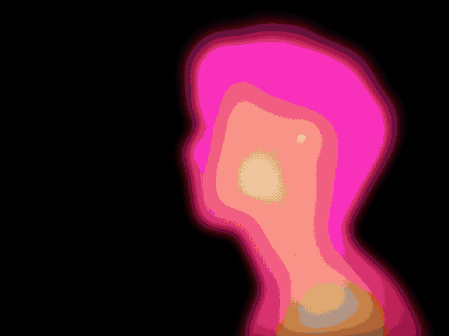

# thought-to-text

A 20-second film about brain-computer interfaces, made by **decompiling** someone else's viral edit frame by frame and rebuilding it with code.

> *how do you speak, when you can't say a word?*
> *you dont. you just think it.*
> *through signal. intention. language.*
> *through ones own mind, straight to* **T E X T**



The reference was Jordan Watkins' *"i'd love to see AI try and recreate this"*: a kinetic poem built from pixel-art objects, thermal silhouettes, typewriter cards and a score that goes quiet in exactly the right places. This repo is the answer to that caption.

## How it was made

```
reference.mp4
   |  tools/teardown.py      cuts, beats, palette, onsets, 0.15s frame strips
   v
reference/TEARDOWN.md       beat table, verbatim copy, motion vocabulary
reference/template.json     same structure, content replaced by slots
   |
   |-- film/   Remotion (React). 14 scenes, all in absolute seconds, seek-safe
   |-- score/  SuperCollider NRT score, every hit placed on a cut
   |           + ElevenLabs voiceover placed on the original VO's word timings
   v
thought-to-text.mp4
```

| layer | what | tool |
|---|---|---|
| analysis | 14 hard cuts, 108 BPM, every cut within 0.15 s of a music onset | `tools/teardown.py`, librosa, faster-whisper |
| picture | 3D-extruded pixel sprites, thermal figures, grain, ink, pen loops, typewriter cards | Remotion 4, Google Sans |
| assets | 14 sprites, 2 thermal plates, 1 paper scan | gpt-image (prompts in `film/assets/prompts/`) |
| score | lo-fi keys, 808, chip arps, spray hiss, typewriter clacks, silence for the coda | SuperCollider |
| voice | 5 lines, "Will" voice | ElevenLabs |

The rule that made it work: **keep the timing, swap the nouns.** The reference's pacing (slow open, 0.5 s strobing middle, 0.3 s per letter, a 3 s near-silent ending) was the expensive part. The new film reuses it exactly.

## Run it

```bash
cd film && npm install
npm run studio           # scrub
npm run render           # -> film/out/thought-to-text.mp4
```

Rebuild the soundtrack (optional, `film/public/audio/mix.wav` is committed):

```bash
cp .env.example .env     # ELEVENLABS_API_KEY, only needed to regenerate VO
score/vo.sh              # new voiceover takes (optional)
score/render.sh          # SuperCollider -> music.wav, + VO -> film/public/audio/mix.wav
```

## Layout

| path | what |
|---|---|
| `reference/` | teardown of the original edit (text only, no footage) |
| `tools/teardown.py` | the decompiler ([video-teardown](https://github.com/RomanSlack/video-teardown)) |
| `film/src/theme.ts` | the beat map. Every scene reads its times from here |
| `film/src/scenes/` | one file per act |
| `film/STORYBOARD.md` | beat-by-beat script, copy and VO timings |
| `score/score.scd` | the score, events placed by absolute time |
| `.claude/skills/remake-an-edit/` | agent guide for doing this to any edit |

## Credit

Reference edit by Jordan Watkins. None of the original footage, frames or audio is in this repo; `reference/` is a written analysis.

MIT.
